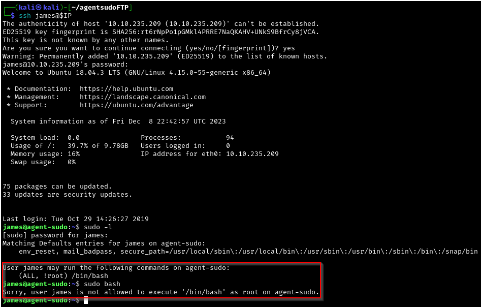

# Agent Sudo - Tryhackme 

---

This is a writeup for the beginner CTF "Agent Sudo" on TryHackMe. This room is located at https://tryhackme.com/room/agentsudoctf and is a free room. I am documenting the process I used to find all information in this writeup **WITHOUT** including any flags, in the spirit of the game. However, following this process exactly should result in a full compromise of the target system.

---

## Recon, Scanning, and Enumeration

My first step was to export the box's IP address to a variable that I could use easily for the rest of the engagement. Next I pinged the box to ensure that it was alive and ready for enumeration.

Next I ran a quick `nmap` scan to see which ports were responding on the host: 

After that I wanted to further enumerate the service versions and run some basic `nmap` scripts against these ports:

I also ran an `nmap` scan of all ports following this, but I did not discover any more open ports on this box. The first thing to check out is the web server running on port 80:

The landing page suggests that manipulating the user-agent can affect the page, so I attempted just using "R" (as in Agent R) with the "User-Agent Switcher and Manager" Firefox extension, and received the following message:

The line about being "one of the 25 employees" seems to suggest that each employee is represented by a different letter, so I threw together a quick `bash` one-liner to check each letter as the user-agent string:

`for letter in {A..Z}; do echo "\n# Trying $letter" >> useragents.md; curl -A "$letter" $IP -L >> useragents.md ; done`

For this output, I was only able to get unique page responses for "C" and "R." I checked "J" since he(/she?) is mentioned in the body of the page when viewing the page as "C," but no luck.

## Gaining Access

In any case, we now have the username "chris" and an indication of a weak password. I figured that with an FTP service and an SSH service remaining, it would be too easy to have SSH now so I used `hydra` to brute-force the password for the "chris" account:

With this password found, we are able to log in to the FTP service as "chris" and dump the contents to our attacking machine:

Reading the To_agentJ.txt file gives us the indication that we will need to extract files from the pictures we downloaded. The first of these, the "cutie.png" file, contains a zip file when extracted with `binwalk`. The zip file is password protected, so I supplied the zip file to `zip2john` and passed the resulting hash to `john` to crack. Using this, we are able to gain a password:

I tried using `unzip` with the password, but I was not able to unzip the file using this method so I pivoted to using `7z` instead. This allowed me to get a new "To_agentR.txt" file that replaced the empty one we found with `binwalk`. This file ocntains a message with an odd looking string:

I used CyberChef.io to decipher the string - at first I thought it looked like some sort of rotation, but after trying all the options, I tried a Base64 decode and immediately got the string "Area51."

Since the only remaining file is a JPG file, I assumed that this string was probably going to be the password for another hidden file. This time I used `steghide` to extract "message.txt" from the "cute-alien.jpg" file, containing a message to a new user, "james."

With this new username and password, I logged in to the remiaining SSH service. Since the CTF is called "Agent Sudo," I assumed it would be a simple privilege escalation using `sudo -l` to find a service that we can run as root. However, you can see that there is a "!root" exception to the "james" user's sudo privileges for bash, which I demonstrated here:

## Privilege Escalation

Luckily I was easily able to find a local privilege escalation exploit by Googling for the `sudo -l` output string and adding "exploit" at the end. The first result was for an exploit-db proof of concept, which explains that if you supply an arbitrary nonexistant UID along with our `sudo bash` command, some versions of `sudo` will not give us the correct UID and will instead give us a UID of 0, or root.

The exploit-db page, https://www.exploit-db.com/exploits/47502, gives a python exploit as well that will use this method against any binary; I didn't think this was necessary to use as we could just use the proof of concept command to escalate our privileges in this case:

As this was an easily rootable box, I didn't enumerate the flags beforehand, but their locations were easily guessable and seeing as no lateral movement was needed on this box, it's fine to just grab them as root after full compromise (not a viable first blood strategy, but this bad boy is dead 😁).
