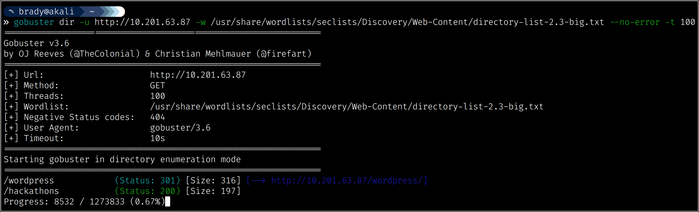

# All in One - TryHackMe

---

This is a write-up for the easy CTF "All in One" on TryHackMe. This is a free room located at https://tryhackme.com/room/allinonemj. I am documenting the process I used to find all information in this writeup **WITHOUT** including any flags, in the spirit of the game. However, following this process exactly should result in a full compromise of the target system.

---

## Recon, Scanning, and Enumeration

My first step was to ping the box to ensure that it was alive and ready for enumeration:

Next, I ran a quick `nmap` scan to enumerate the service versions and run some basic `nmap` scripts against found ports:

We see that we have anonymous FTP access on this machine, which is a great place to start! We also have SSH, which will help us if we find some credentials to use, and an Apache web server running on port 80.

First, we can try out our anonymous FTP access:

This doesn't seem to yield any files, so we will pivot to the web service. We can check out the web root in our browser:

This is a default webpage, which is a common finding in labs and penetration tests alike. We can note information about the operating system and move on to fuzzing for hosted directories:

The more unique of these pages is "/hackathons," which is a static HTML page with a cryptic message:

We find some information if we view the page source. We'll take note of this HTML comment, as this may be sensitive information left carelessly by a developer:

Moving on to the other page, "/wordpress," we are redirected to a landing page for a WordPress site:

Scrolling down, we see some helpful links:

The login link, in particular, will help us later. We are taken to the WordPress login page:

Something of interest on this login page is the fact that invalid usernames produce a unique error message. This means that we could find valid usernames by fuzzing for usernames that don't produce this message:

Now that we have a general idea of the site layout, we can move on to a scanner called`wpscan` that is designed to enumerate WordPress sites. Since we don't know exactly what we're looking for, we'll throw several enumeration modes at the site and see what comes back. 
The flags I'm using are to enumerate all plugins, all themes, Timthumbs (image resizing scripts), config backups, database exports, and users. You can supply an API key from [wpscan.com](https://wpscan.com/) with a free account to unlock some more in-depth scanning:

Notice that I'm also using `tee` to write the output to a file - `wpscan` will typically take a LONG time with the given options, and usage of the API key is limited, so we wouldn't want to have to run this more than once. This is obviously not the most efficient option, but more of a catch-all to demonstrate what you might do if you needed to save API requests and didn't know what to look for.

After looking through our output, we can see that a vulnerable version of a plugin called Mail Masta is installed: 

We will find that we can exploit this plugin to exfiltrate sensitive information.

## Initial Access

Since we saw some [Exploit-DB](https://www.exploit-db.com/) links in our output, we can use `searchsploit` to look for locally saved versions of the exploits:

Through trial and error, we can find the exploit that we want. In this case, we will mirror exploit 40290 to our local directory. Since this is just a text file, we can view the information in an application of choice:

We can see that there is a local file inclusion (LFI) on count_of_send.php, where we can use the "?pl" parameter to include a file from the victim's operating system.

After researching suitable WordPress LFI targets, we can find that a file located at /var/www/html/wordpress/wp-config.php will sometimes contain sensitive information. If we attempt the LFI, we don't get any output. This is because the `include($_GET['pl'])` line is executing the PHP code, not viewing it:

We can get around this by using a wrapper to encode the raw code to base64, which will cause the encoded text to be printed instead of executed:

We can decode the encoded string to view the file contents:

We end up finding credentials in the configuration file!

Although we do have valid credentials, for demonstrative purposes, we can use the username disclosure we found earlier to confirm that this is a valid username:

We are able to authenticate successfully with the credentials we found:

With administrative access to WordPress, we are able to gain remote code execution in several ways. The way I will show in this writeup is by uploading [a webshell plugin](https://github.com/jckhmr/simpletools/tree/master/wonderfulwebshell).

We will have to zip up the PHP file, after which we can upload it in the "plugins" tab, and finally, we will need to activate the plugin:

We can now use the webshell to execute commands on the system:

We can use the webshell to upgrade ourselves to a reverse shell. This is an extra step, since we *could* have used a plugin to get a reverse shell directly. We will need to start a listener using `nc`, after which we can connect back to the listener using our method of choice. We could use [revshells.com](https://www.revshells.com/) (not pictured) to generate a payload that points to our VPN IP address.

## Initial Access - Alternative Method

This is a less realistic attack path, but it utilizes the HTML comment that we found earlier:

The hint with "Vinegar" is that this is a *Vigenère* cipher. We can decode the top line using the bottom line as the key with a [Vigenère solver](https://www.boxentriq.com/code-breaking/vigenere-cipher):

We can use this password; we would just need to know the username. We could brute-force a username with enough time, but since the name is a bit non-standard, it might take longer than we'd want to spend. Another route is that we could check our `wpscan` output for enumerated usernames:

From here, we would log into WordPress and gain RCE in the same way as before.

## Privilege Escalation

Now that we have an (unstable) reverse shell, we can stabilize using python3, which we already know that we have on this machine:

Checking the known user's home directory, we can see that the flag cannot be read by our current www-data user. However, there is a conspicuous file that we do have the necessary permissions to read: 

This file does exactly as advertised:

The next step is a bit of a stretch in my opinion, but after eventually checking for files owned by the elyana user using `find / -user elyana -type f 2>&1 | grep -v 'Permission denied'`, we find /etc/mysql/conf.d/private.txt:

Now we are able to connect using SSH with this user's valid credentials and read the user flag. For some reason, this room's flags are encoded, but we can easily reverse this using a previously shown method:

One of the simplest privilege escalation checks we can do is listing `sudo` permissions:

In this case, we are able to run `socat` with `sudo` with no password. We can check [GTFOBins](https://gtfobins.github.io/) for known privilege escalation vectors with `socat`:

We can successfully use this vector to escalate to root:

Optionally, as this is another unstable shell, we can stabilize using the same method as before. We can then read the root flag:

Thanks to [i7md](https://twitter.com/i7m4d) for the creation of this challenge!
