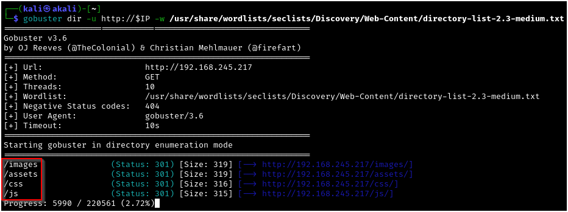

# Blogger - Proving Grounds 

---

This is a writeup for the "Blogger" lab on Offensive Security's Proving Grounds. My YouTube walkthrough for this lab is at https://youtu.be/2iw_bDwDBp8, so you can watch these commands run in real time! This lab is part of tjull's PWK V3 list, a well-known list of labs that are supposed to be similar in difficulty and approach to OSCP-level machines. This machine is available in the "Proving Grounds Play" section and is free to use. This lab is rated "easy" by the publishers, but "hard" by the community. I am documenting the process I used to find all information in this writeup **WITHOUT** including any flags, in the spirit of the game. However, following this process exactly should result in a full compromise of the target system.

---

## Recon, Scanning, and Enumeration

My first step was to export the box's IP address to a variable that I could use easily for the rest of the engagement. Next I pinged the box to ensure that it was alive and ready for enumeration.


Next I ran a quick `nmap` scan to see which ports were responding on the host: 


After that I wanted to further enumerate the service versions and run some basic `nmap` scripts against these ports:


With neither of these service versions being immediately exploitable, I took a look the webroot of port 80:


After fully enumerating the website that's being hosted here, I am not able to see anything that appears to be exploitable. Running a `gobuster` scan of the IP address reveals further directories to enumerate:



Digging into the /assets directory reveals a directory called /fonts, which in turn has a directory called /blog:


Although the location of this content is somewhat annoying, we've finally uncovered some "blog" content, which includes a potential username alongside the filler content:


Scrolling to the bottom of this blog reveals a "Log in" link, whose URL indicates that the blog is being hosted using Wordpress:


Using `wpscan` to enumerate the Wordpress installation with agressive plugin detection took just over 20 minutes, but eventually yielded the plugins for the site, of which one is known to be vulnerable:


## Gaining Access

Using `searchsploit` (a command-line implementation of Exploit-DB, which is managed by OffSec - a good idea when working with OffSec's labs) we can find a Remote Code Execution exploit for wpDiscuz 7.0.4. We can download this exploit with the `-m` flag for futher use:


After reviewing our exploit, we can run it with no parameters to display the usage example. We will then supply the path to the wordpress installation that we used earlier for `wpscan`, as well as the path to a post on the site, which we found by navigating to one of the posts.


Note that the exploit's webshell path changes our IP address to "blogger.pg." We will need to add this to our /etc/hosts file to override DNS resolution in order to use the webshell.

Using the webshell in the terminal did not work for me, but navigating to the presented URL and supplying a `?cmd=` parameter allows command execution on the underlying operating system:


Since we know we can run OS commands, let's use a payload from https://swisskyrepo.github.io/InternalAllTheThings/cheatsheets/shell-reverse-cheatsheet/ to gain a reverse shell on the target:


## Privilege Escalation

After stabilizing our shell with the following commands, we are able to run `sudo -l` on the target, but since we do not have the `www-data` user's password, we are not able to run any sudo commands:

```
python3 -c 'import pty;pty.spawn("/bin/bash")'

Ctrl + Z (to background the shell, taking us back to our host machine's shell)

stty raw -echo;fg (on the host shell - gives us a raw terminal with no input or output processing, then foregrounds the reverse shell from the victim machine)

export TERM=xterm (sets the TERM variable so that we can use commands like clear in the reverse shell)
```


We can concatenate the /etc/passwd file, and I like to use `grep` here to filter out the users that do not have a default shell. 


After reviewing the list of users, we find that one of these is using a default password. This `vagrant` user also has sudo privileges to run all commands as root, so we are able to escalate and show full compromise by reading the proof.txt file:


Thanks to TheHackersBrain for creating this machine and to tjnull for adding it to the coveted OSCP prep list. I'm not sure this machine deserves its "hard" community rating, as I thought it to be of similar difficulty to the OSCP machines I had on my exam (although I obviously cannot elaborate further). I think the community rating likely comes from the hidden Wordpress installation, as the rest of the lab is pretty straight-forward after you find it.
