# Brooklyn Nine Nine - TryHackMe 

---

This is a writeup for the beginner CTF "Brooklyn Nine Nine" on TryHackMe. This room is located at https://tryhackme.com/room/brooklynninenine and is a free room. I am documenting the process I used to find all information in this writeup **WITHOUT** including any flags, in the spirit of the game. However, following this process exactly should result in a full compromise of the target system.

This room has TWO intended solve paths, and I will document each. Neither one relies on information from the other, and either solve could be seen as a potential backup should the other be "patched."

---

## Recon, Scanning, and Enumeration

My first step was to export the box's IP address to a variable that I could use easily for the rest of the engagement. Next I pinged the box to ensure that it was alive and ready for enumeration.

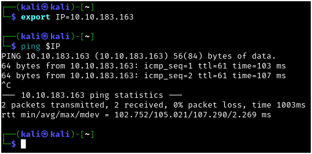

Next I ran a quick `nmap` scan to see which ports were responding on the host: 

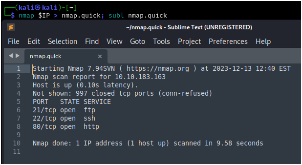

After that I wanted to further enumerate the service versions and run some basic `nmap` scripts against these ports:

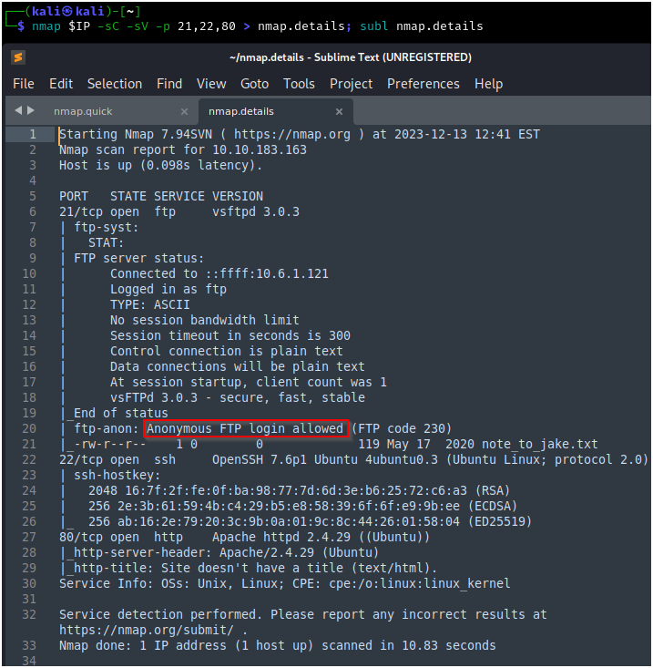

I also ran an `nmap` scan of all ports following this, but I did not discover any more open ports on this box. This box has an FTP service that allows for anonymous login, and a web server running on port 80.

## First Solve Path - Jake

The first solve path is simpler, and would be the first that I would take in terms of "low-hanging fruit." This solve involves the vulnerable FTP service. As detected by the `nmap` scripts, we are able to log in anonymously and find a note from Amy to Jake, who is our first user:

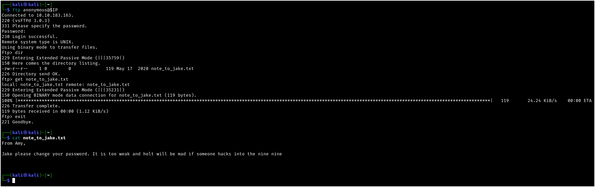

With the note that Jake has a weak password, we can attempt a brute-force of the SSH service using `hydra`:

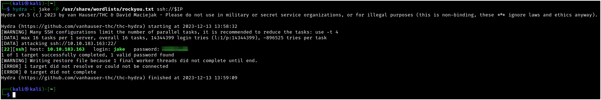

Using the credentials found with `hydra`, we can successfully `ssh` into the box as Jake. Checking his `sudo` permissions, we are able to see that Jake can run `less` as root:

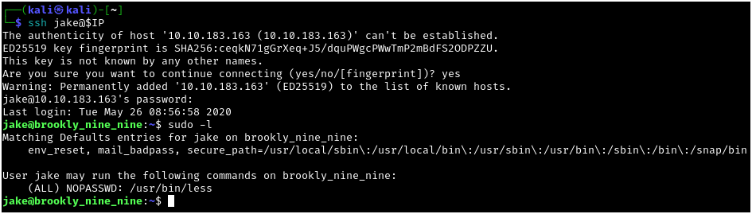

GTFOBins offers a well-known method to maintain the root privileges running `less`:

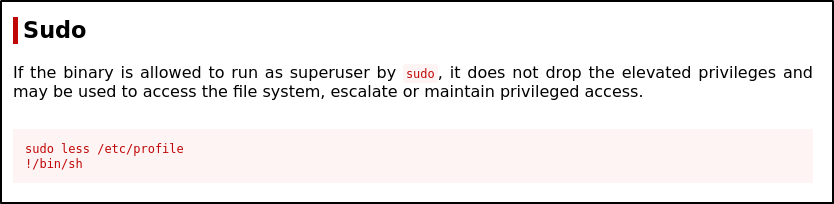

We can run `less` against any file (in this case /etc/passwd) and supply a command to the program, which will be run with the permissions that ran `less`:

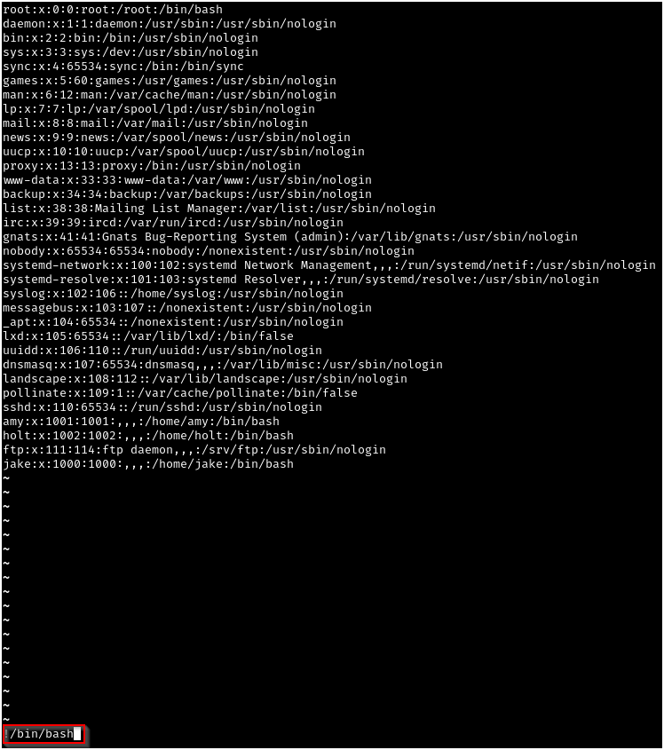

Using this method we are able to escalate to a root shell and read the root.txt file:

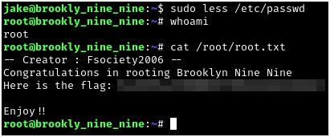

## Second Solve Path - Holt

Since the other method relies on a pretty insecure setup, we can assume for the purposes of demonstration that it could be patched following a breach. This is a slightly more complicated, but still beginner-level solve path that we could use in such a case.

The machine is also hosting a web server on port 80 that we can access via our browser:

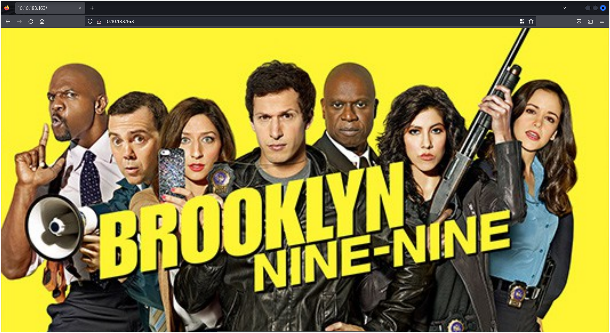

Viewing the page source, we can see two important items - the path to the image file that we can see on the landing page, as well as an HTML comment referencing steganography:

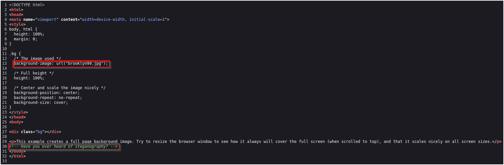

Obviously, such a comment is unlikely in a real engagement, but in a beginner CTF this could be considered standard practice. Since we aren't presented with any other files in a `gobuster` scan (not pictured), we can assume the steganography to have been performed on the brooklyn99.jpg image. After downloading the image, we can try `steghide`, but as there is a passphrase I've used `stegseek` (https://github.com/RickdeJager/stegseek/) to crack it. We are able to see a note with Holt's password:

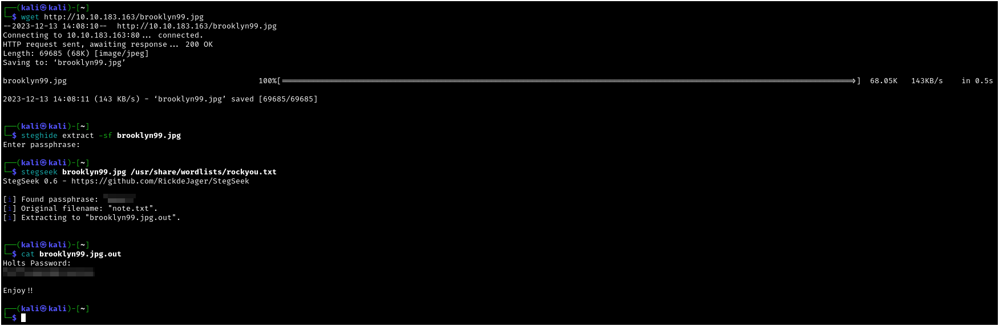

After we `ssh` into the machine as Holt, we can check his `sudo` permissions:

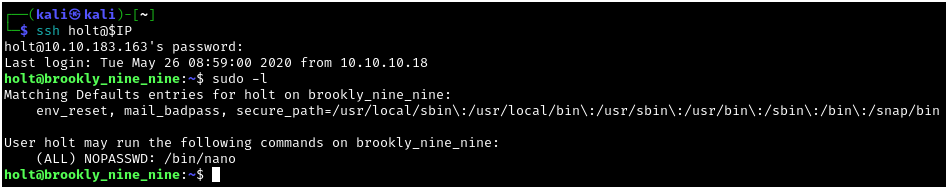

Since we see `nano` can be run as root, we can again reference GTFOBins for a well-known privilege escalation method:

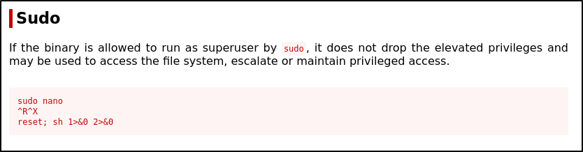

After running `sudo nano` we can use the `Ctrl + R` and `Ctrl + X` commands to gain a vector for command execution:

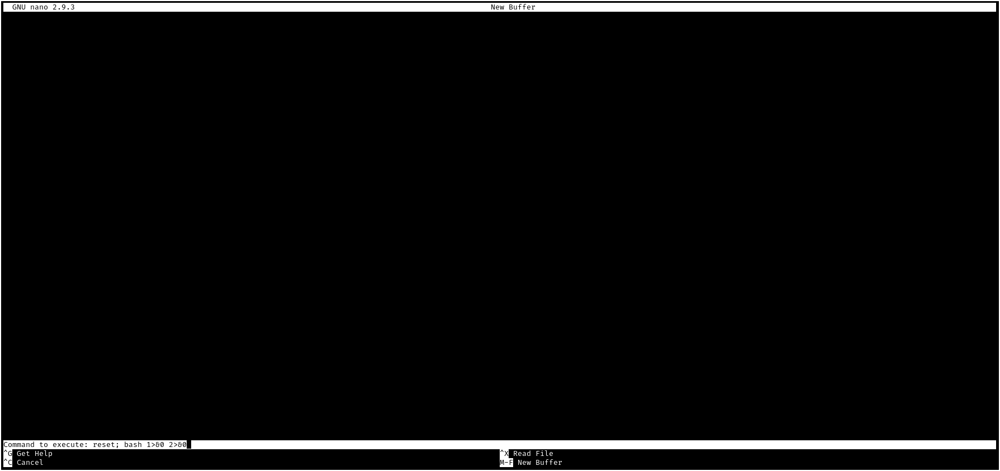

I slightly modified the command to get a `bash` shell instead of `sh`, but this will get us a shell as root, and we can prove this by reading the root.txt file as before.

Thanks to Fsociety2006 for the creation of this challenge. RIP Andre Braugher, July 1, 1962 - Dec 11, 2023.