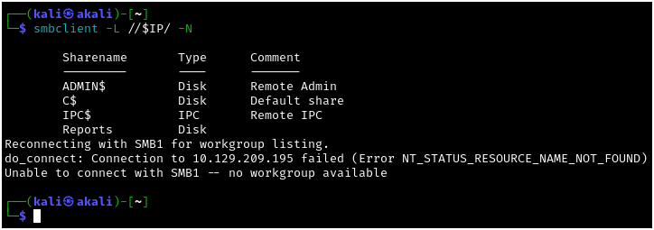
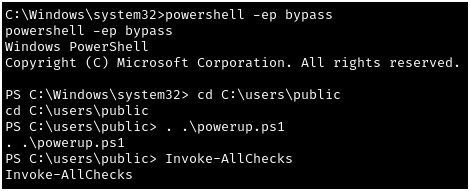

# Querier - Hack the Box

---

This is a writeup for the medium-level CTF "Querier" on Hack the Box. This room is located at https://app.hackthebox.com/machines/Querier and is a retired room. I am documenting the process I used to find all information in this writeup **WITHOUT** including any flags, in the spirit of the game. However, following this process exactly should result in a full compromise of the target system.

I have found three distinct methods of escalating privileges on this machine at the time of writing, and I will demonstrate each of them as a standalone solution for the root flag.

---

## Recon, Scanning, and Enumeration

My first step was to export the box's IP address to a variable that I could use easily for the rest of the engagement. Next I pinged the box to ensure that it was alive and ready for enumeration.

Next I ran a quick `nmap` scan to see which ports were responding on the host: 

After that I wanted to further enumerate the service versions and run some basic `nmap` scripts against these ports. This doesn't reveal much that we didn't already know, other than the NetBIOS name of the machine, QUERIER.HTB.LOCAL:

I also ran an `nmap` scan of all ports following this, but this did not result in anything that will be substantial for the purpose of this writeup.

We can see that there is an MSSQL server running on port 1433, but SMB on port 445 is a more likely attack vector, so we'll start our enumeration here. Checking for null sessions, we can see that we have a "Reports" share that we have access to:

Mounting this share for ease of access reveals that the share contains a file, "Currency Volume Report.xlsm." This is a macro-enabled Microsoft Excel file, and may contain some useful information:

After copying the file to our home directory with a friendlier name, we can run `binwalk` on the file to see embedded files and executable code:

We can now extract these files with `binwalk -e` for further inspection:

After further enumerating each of these files, we find that a set of credentials are stored in clear text within xl/vbaProject.bin:

## Gaining Access

Remembering the other services that we have available, we can try these credentials against the MSSQL server using `impacket-mssqlclient`:

Since we are able to run commands against the SQL service, let's see if we are able to run commands with xp_cmdshell, which will give us remote code execution on the target:

Here, we can see that our first command came back with no results, meaning the xp_cmdshell is not currently enabled. We try to configure advanced options, which will allow us to enable it, but are told that this user does not have the proper authorization to do so.

Initially, I thought we would have to manually enumerate the database for our next steps, but luckily we can use a sneaky trick (explained here: https://medium.com/@markmotig/how-to-capture-mssql-credentials-with-xp-dirtree-smbserver-py-5c29d852f478) to capture a NetNTLMv2 hash with the MSSQL `xp_dirtree` command.

The `xp_dirtree` command takes three parameters: the directory you want to connect to, the subfolder depth you want to display, and finally the option to display files. Since we do not need any files or subfolders in this case, we can host a share with `impacket-smbserver` and specify it as the first parameter, setting the remaining parameters to zeroes:

Typically I would take this hash offline to try to crack it, but with the knowledge that this hash cracks easily, we can use `hashcat` on a VM to crack the hash in this case. After saving the hash to a file, we can check the hashcat mode for NetNTLMv2:

We are able to crack this hash, gaining the credentials for the mssql-svc user:

We can confirm that we are able to login with these credentials, once again using `impacket-mssqlclient`:

With this new logon, we can retry enabling xp_cmdshell to gain code execution:

Through trial and error, it seems that we do not have access to certutil.exe, so we can transfer nc.exe (nc64.exe from https://github.com/vinsworldcom/NetCat64/releases) to the machine using PowerShell:

Finally, we can gain a reverse shell on the target by supplying nc.exe with the IP address of our attacking machine and the port we are listening on:

## Escalating Privileges

As stated in the exposition, I have found three ways to escalate privileges to the system user as of the time of writing. I will demonstrate these in order of most to least technical, with the aim of showing the more interesting escalations first.

### Method 1: binPath

Now that we are on the machine, we will need to enumerate and try to find a way to elevate our privileges. The simplest solution I found for this box was using PowerUp.ps1 (https://github.com/PowerShellMafia/PowerSploit/blob/master/Privesc/PowerUp.ps1), which we will transfer to the machine using PowerShell:

After now that we have PowerUp.ps1 on our victim machine, we can drop into PowerShell, import the module, and call the Invoke-AllChecks commandlet from PowerUp to check for privilege escalation vectors:

PowerUp.ps1 will find all of the escalation vectors we are going to touch in this walkthrough, starting with the writable service "UsoSvc":

Since we have the power to modify this service, we can drop back into cmd.exe and modify the binPath to whatever we'd like; in this case, we'll have it rerun our already transferred nc.exe binary to send us a new shell:

Starting the service will now execute our modified binPath, giving us a system-level shell on the target:

### Method 2: cPassword

The second method was also shown to us in PowerUp.ps1, but assuming we hadn't seen that, we could also continue to enumerate to find our second privilege escalation vector, which is finding the Administrator's password in a cPassword string.

Again, assuming that we weren't already given the location of this file by an automated enumeration tool, we could use PowerShell to search for Groups.xml, the name of a file that will sometimes contain cPassword strings:

Reading the contents of this file reveals our cPassword string, which in this case is the encrypted password for the Administrator user:

We are able to decrypt this cPassword string using `gpp-decrypt` and (because the user is an administrator) we can log in via `impacket-psexec`:

### Method 3: Escalation via SeImpersonatePrivilege

The final method is the simplest to execute, and would be a quick win even if we did not find either of the previous two methods. Checking our privileges with `whoami /priv` shows that we have SeImpersonatePrivilege, which will allow us to escalate using a potato attack:

We can transfer GodPotato (https://github.com/BeichenDream/GodPotato/releases/tag/V1.20) and run it with a command-line argument of the nc.exe binary that we already transferred, resulting in a reverse shell as the system user:

Special thanks to the creators of this challenge, mrh4sh & egre55! This was a fun machine to practice multiple Windows privilege escalation methods.