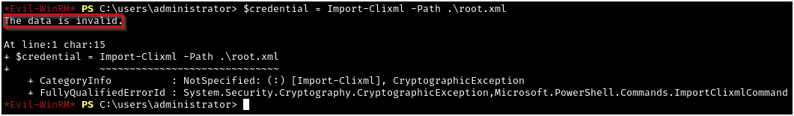

# RazorBlack - Tryhackme 

---

This is a writeup for the medium-level CTF "RazorBlack" on TryHackMe. Be on the lookout for my video walkthrough, coming soon and will be linked here! This room is located at https://tryhackme.com/r/room/raz0rblack and is a free room. I am documenting the process I used to find all information in this writeup **WITHOUT** including any flags, in the spirit of the game. However, following this process exactly should result in a full compromise of the target system.

Another note - this lab is objective based, but I will show the most direct way to domain compromise first, and then clean up the rest of the objectives at the end.

---

## Recon, Scanning, and Enumeration

My first step was to export the box's IP address to a variable that I could use easily for the rest of the engagement. This IP is going to change several times during this walkthrough, as this machine seems to become unresponsive after an hour, regardless of remaining lab time. Just note that there is only one machine, and we are always targeting the same machine regardless of different IPs you may see in this writeup.

Next I pinged the box to ensure that it was alive and ready for enumeration.


Next I ran a quick `nmap` scan to see which ports were responding on the host: 


After that I wanted to further enumerate the service versions and run some basic `nmap` scripts against these ports:


From this output, we can tell what our hostname and domain name are, which helps us answer our first objective. We can add this hostname to our /etc/hosts file since we'll be interacting with Kerberos later.


Now that we have the hostname saved in our /etc/hosts file, we can use it to interact with this IP address for the rest of the engagement.

Since we saw that we have NFS shares on this machine, we can use `showmount -e` to show the export list:


The next step has many moving parts, so I'll explain them step by step. First, I am making a directory to mount the NFS share in. This share will be mounted with the permissions native to the NFS share, meaning that none of the attacking machine's users (including root) will have the necessary permissions to manipulate the files. Because of this, we will create a second directory (in this case "openmount") to house the contents that we will copy from the active NFS mount. After giving full permissions to the new location, we can change directories into the directory, use `sudo` to give ourselves read and write permissions to the contents, and we will finally be able to interact with the copies of the files we have made from the original NFS share:


We can now collect the flag for one of our objectives from the sbradley.txt file, and open the Excel workbook file:


We now get a list of potential users from the Excel workbook file:


Since we see the user "steven bradley" and we had a file called "sbradley.txt" earlier, we can extrapolate that the username convention is first initial and last name. We can use this naming convention to create a wordlist from the gathered names:


Since we don't yet have credentials, we can use Kerbrute (https://github.com/ropnop/kerbrute/releases/tag/v1.0.3) to determine which of these usernames are valid:


Since one of the users, twilliams, does not require Kerberos pre-authentication, we can perform an AS-REP roasting attack to extract a KRB5TGT hash for the user:


We can now use `hashcat` with the appropriate mode to crack the hash and gather our first set of valid credentials:


With our newly found credentials, we can query the domain controller for accounts with Service Principal Names (SPNs), and perform a Kerberoasting attack:


We can again use `hashcat` with the appropriate mode to crack the hash and gather credentials for this service account:


## Gaining Access

We can use `netexec` to check what access this new user has. Here we can see that xyan1d3 has WinRM access to the Haven-DC machine (note that the "Admin!" note is not indicative of admin status in the WinRM mode of `nxc`, and instead just shows that we have WinRM access):


We can use `evil-winrm` to gain a PowerShell shell on the target. Note here that we are running commands as the raz0rblack\xyan1d3 user, who is a member of the "Backup Operators" group and has the SeBackupPrivilege and SeRestorePrivilege as a result:


## Privilege Escalation

A good resource for this privilege escalation is from Nairuz Abulhul at https://medium.com/r3d-buck3t/windows-privesc-with-sebackupprivilege-65d2cd1eb960. Because the SeBackupPrivilege allows us to make backups of the filesystem, we can use `diskshadow` to make a shadow copy of the entire C:\ drive and extract the NTDS.dit file. However, using `diskshadow` from `evil-winrm` is slightly complicated, as we are not able to get an interactive console:


To get around this shortcoming, we can use the `/s` parameter to pass a script to `diskshadow`, which will run our commands automatically:


Note that the script I created was running into an issue where the last character of each line would be removed, so I just added an "X" at the end of each line (except the last line, which runs as normal) to combat this. The full content of the script is shown in the bottom pane, while the output is shown in the top pane:


Next we will use `robocopy` to back up the NTDS.dit file to our current directory:


Next, we will need to export the SYSTEM registry hive from HKEY Local Machine and save a copy that we can exfiltrate to our attacking machine:


Finally, we'll need to download the two files:


Note that the files are rather large, and downloading these in sequence like this will take quite a bit, so I'd recommend a second `evil-winrm` session to download them in parallel.

Now we can run `impacket-secretsdump` on our attacking machine, supplying the SYSTEM key to decrypt the NTDS.dit file, and dump the hashes of all the domain users:


We can again use `evil-winrm` and supply the NT hash for the Administrator user, after which we can confirm that we are a domain/enterprise admin and have fully compromised the domain:


---

## Additional Objectives

In this section, I'm going to try to complete the remainder of the challenges in a way that flows logically. We'll be jumping back and forth between some users we've already compromised, as well as compromising some new users, so hopefully you've taken good notes up to this point!

### Xyan1d3's Flag

We can log back in with xyan1d3's credentials to find a PSCredential XML file in the user's directory.


Despite the "UserName" field's attempts to dissuade us, we can use PowerShell to extract the "Password" from the PSCredential file. The syntax we will use for each of these is as follows:
```
$credential = Import-Clixml -Path .\<XML filename>
$password = $credential.GetNetworkCredential().Password
Write-Host "Password: $password"
```


### Root Flag

We can log in using the hash we previously extracted for the administrator user and view the PSCredential XML file as before:


However, when we try to use PowerShell to import the XML file, we get an error message that the data is invalid. This suggests that the data has been modified in some way:



Noting that the "Password" is made up of hexadecimal characters, we can use https://cyberchef.io to decode the string:


### "What is the complete top secret?"

This just relies on manual enumeration. You can use the PowerShell script below for a sure-fire way to locate the file, which I did on a hunch just because of the challenge asking for a "secret." However, since this script scrubs the entire C:\ drive, it will take quite a long time. Manual enumeration might be faster in this case.


We can change to this directory and download the PNG file to view on our attacking machine:


Opening the image, we can see the following:


I believe the joke here to be that the chocolate gorilla is dissolving before being able to tell us the full way to exit `vim`, which is :wq, not :W. We can input the proper method as our answer.

### Ljudmila's Flag

To get access to Ljudmila's (lvetrova) flag, we'll first need to get access to the SMB share on the machine. To do this, we can check for password re-use from the credential we found for twilliams through AS-REP roasting:


As we can see here, the password for twilliams is a valid password for sbradley, but the password needs to be changed. We can use `imacket-smbpasswd` to change this user's password to a new password that we will have access to:


Now that we have validated the new password, we can use it to authenticate to SMB using `smbclient` and download the contents of the available share:


Since we already have the flag for sbradley, we can safely ignore this file and investigate the other two:


Note that the chat logs make reference of ZeroLogon - I have checked with zerologon_tester.py and found that this DC is *probably* not vulnerable to ZeroLogon at this time.

The chat logs also mentioned that sbradley has extracted the NTDS.dit and SYSTEM hive, and uploaded an encrypted version of NTDS.dit - the zip file that we saw in SMB. We will need to use `zip2john` and `john` to extract and crack the hash for the zip file, which is also one of our objectives:


We can see that this hash cracked quickly (only one second in this screenshot), and now we have the password needed to unzip our zip file:


We can now use `impacket-secretsdump` to dump the NTLM hashes of all the users, which we can see is quite a few more than we have in our current domain:


After we remove the impacket header and footer manually, we can use `cut` to remove everything except for the NT hashes by specifying the delimeter of `:` and extracting the fourth field:


We can now use `netexec` to spray these hashes against the lvetrova user, which will eventually yield the correct hash:


Using this hash, we can get a WinRM shell as the lvetrova user:


We can now extract this user's flag from the PSCredential file as we did with the previous two users:


### Tyson's Flag

This is basically just an extra objective to pad our stats - all we need to do is log in with the administrator hash we found earlier, and show the contents of C:\Users\twilliams. We see a very long string that is trying to convince us that this file is not the flag, but by this point we know not to trust the lab developer. Judging by the file size of only 80, this is likely not an executable file, and is in fact just text that we can `type` out:


---

This took quite a bit of time to type up, so thanks if you've read all the way to the end. Hopefully this was helpful if you were working on the lab, and shout out to Xyan1d3 for creating this room on TryHackMe!