# RootMe - TryHackMe 

---

This is a writeup for the beginner CTF "RootMe" on TryHackMe. This room is located at https://tryhackme.com/room/rrootme and is a free room. I am documenting the process I used to find all information in this writeup **WITHOUT** including any flags, in the spirit of the game. However, following this process exactly should result in a full compromise of the target system.

---

## Recon, Scanning, and Enumeration

My first step was to export the box's IP address to a variable that I could use easily for the rest of the engagement. Next I pinged the box to ensure that it was alive and ready for enumeration.

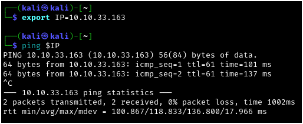

Next I ran a quick `nmap` scan to see which ports were responding on the host: 

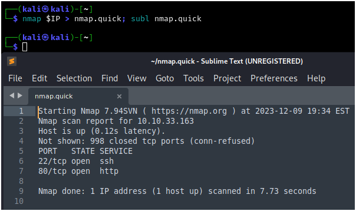

After that I wanted to further enumerate the service versions and run some basic `nmap` scripts against these ports:

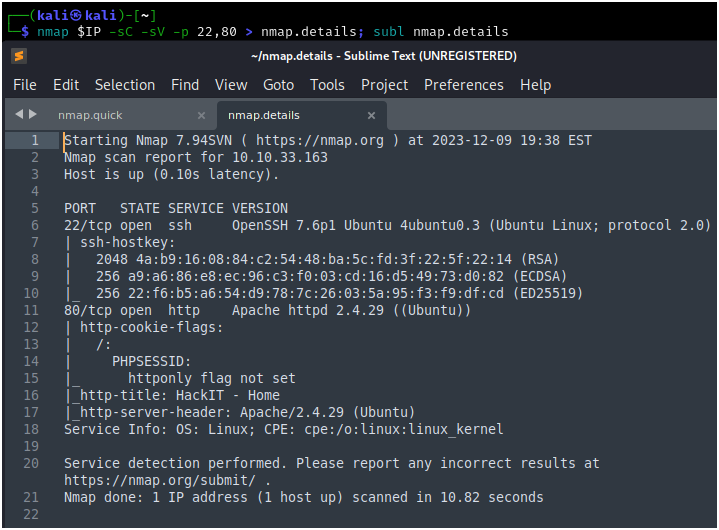

I also ran an `nmap` scan of all ports following this, but I did not discover any more open ports on this box. The first thing to check out is the web server running on port 80:

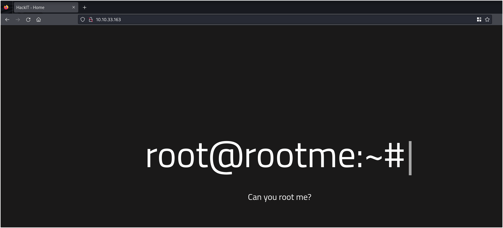

Next I ran `gobuster` in directory mode to see if I could find any interesting directories. Immediately I get /uploads, which is interesting, and right after that I can see /panel, which is interesting as well. 

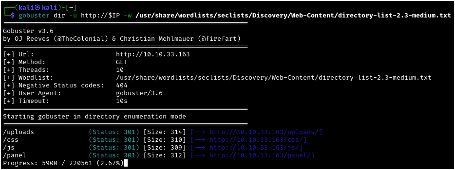

Checking out the /panel page, I can see that we have an unauthenticated upload utility:

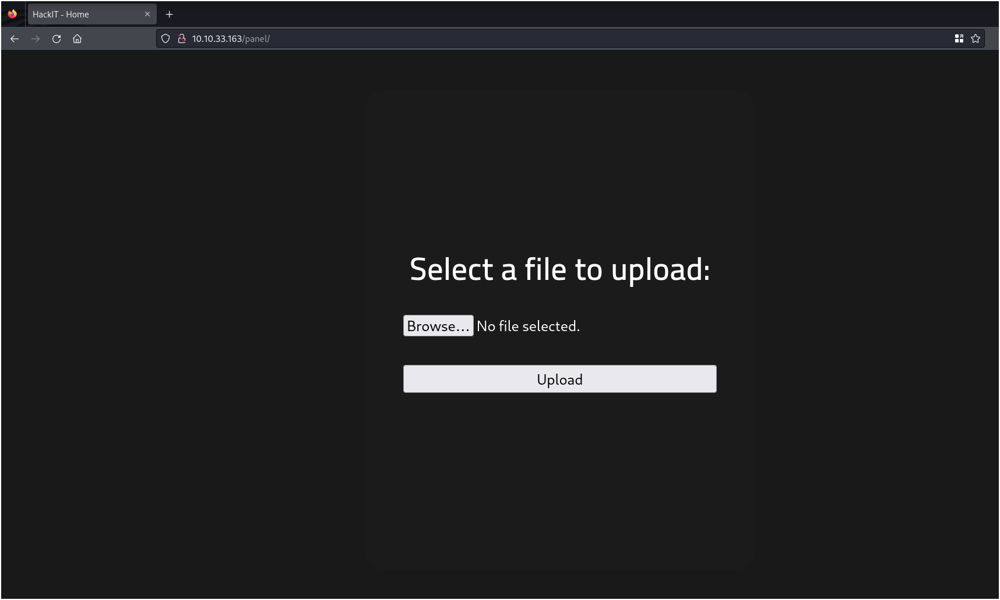

## Gaining Access

Since we know from our `nmap` scans that the web server is running Apache, we can assume that we will be able to run PHP scripts. As such, I modified the Pentest Monkey PHP Reverse Shell (https://github.com/pentestmonkey/php-reverse-shell/blob/master/php-reverse-shell.php) to connect to my VPN IP address over port 9001 (because "it's over 9000!") and uploaded the file as "shell.php." As we can see, the shell is rejected, and we are given a message that PHP is not an allowed file type:

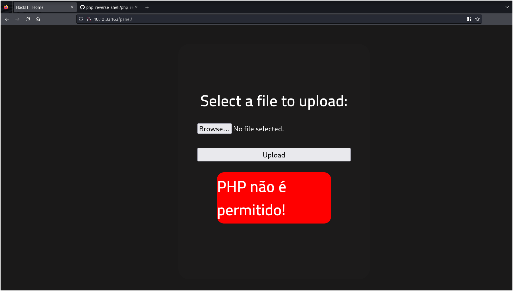

My next thought was to try to inject a null byte into the filename, which should in theory terminate the string and still run the PHP script, ignoring the .jpg extension that I'm adding to bypass the upload filter:

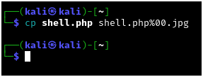

I do get a successful upload here, meaning that I did successfully bypass the filter:

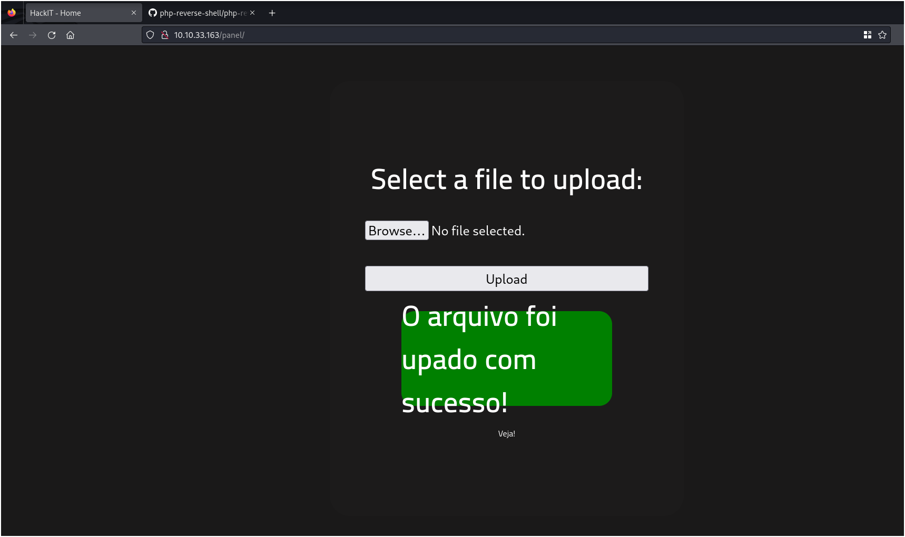

I can see the file that I've uploaded in the /uploads directory that we saw earlier in our `gobuster` scan, which means that this is where the files from the form are being stored:

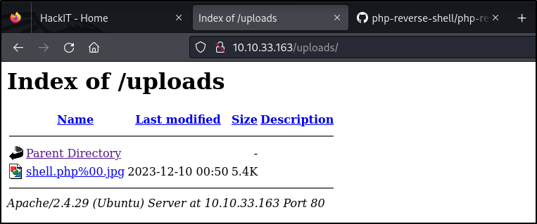

However, when I try to execute this file, I get an error telling me that my "image" cannot be displayed because it contains errors. This means that the null byte injection technique did not work in this case:

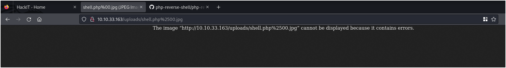

At this point I pivoted to another bypass technique, just using a different types of PHP extension rather than .php. The first one I tried was .phtml:

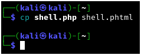

This file also succeeded in bypassing the upload filter, as we can see by viewing it in the uploads directory:

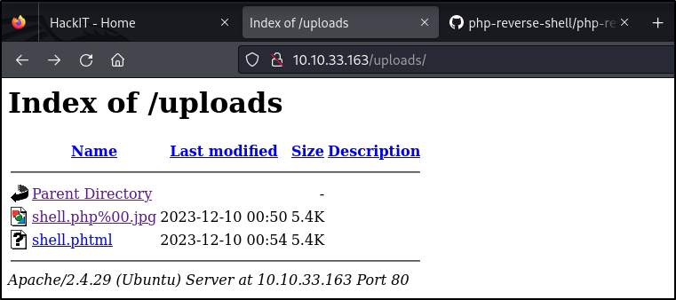

This time, the file is executed properly, and I am able to catch my reverse shell in the listener I set up prior to execution:

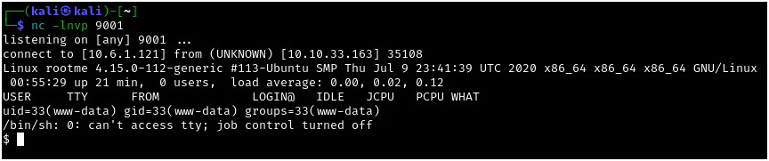

Since the shell I am given is pretty unstable, I use a common `python` stabilization technique here to upgrade to a better shell. The commands I used here are as follows:

```
python -c 'import pty;pty.spawn("/bin/bash")'

Ctrl + Z (to background the shell, taking us back to our host machine's shell)

stty raw -echo;fg (on the host shell - gives us a raw terminal with no input or output processing, then foregrounds the reverse shell from the victim machine)

export TERM=xterm (sets the TERM variable so that we can use commands like clear in the reverse shell)
```

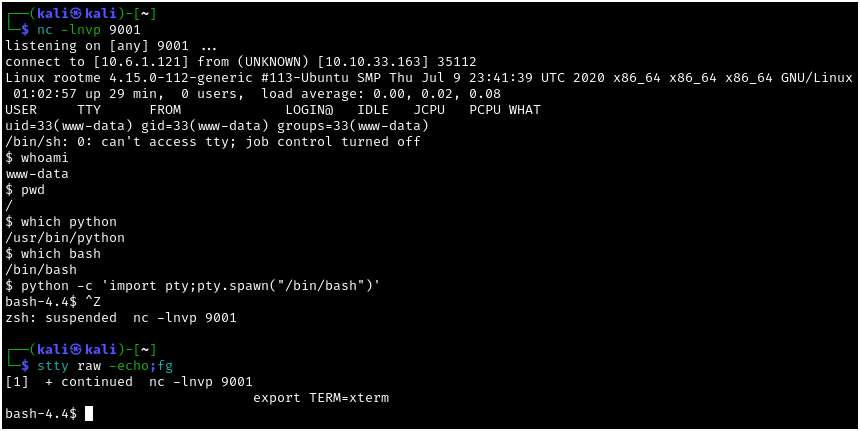

With our shell stabilized, my next step was to start looking around on the target host. You can find the user.txt flag at this point, but I waited until the end to do so, as timely flag submission was not one of my priorities in this engagement.

First I enumerated which users had shells:

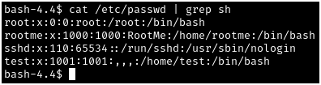

Checking out these users' home directories, I didn't come across anything of interest.

## Privilege Escalation

With no low-hanging fruit in the user directories, I decided to pivot over to LinPEAS to automate my process of finding a privilege escalation vector. I moved over to the /tmp directory, where I knew I'd be able to upload and execute my script, and staged the script using `wget` to download from my attacking machine:

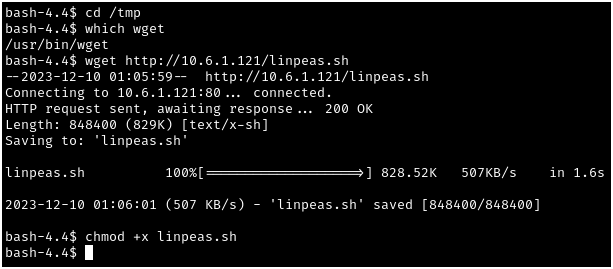

With the script staged, it was time to execute. Early in the runtime of the script, I was able to see the coveted yellow flag, indicating a near-guaranteed privesc vector. In this case, `python` has the SUID and SGID bits set:

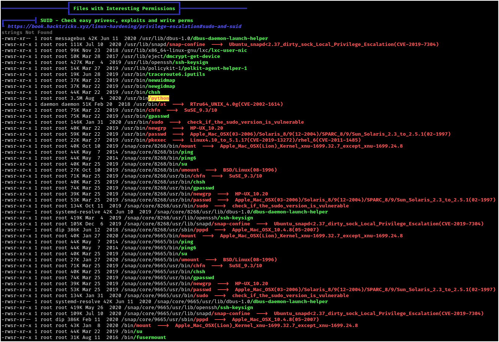

Using GTFOBins, I was able to source a command to escalate privileges exploiting the misconfigured SUID permissions for `python`:


Using this command (slightly modified, because I wanted to use `bash` rather than `sh`) I was able to escalate to root. At this point I was able to prove compromise by reading the root.txt file, as well as the user.txt file that was in the web server directories. 

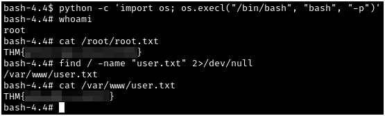

This was a very simple challenge, and I believe it would prove educational for the CTF beginners for whom it was designed. Thanks to ReddyyZ for the creation of this box!
