# tomghost - TryHackMe 

---

This is a writeup for the beginner CTF "tomghost" on TryHackMe. This room is located at https://tryhackme.com/room/tomghost and is a free room. I am documenting the process I used to find all information in this writeup **WITHOUT** including any flags, in the spirit of the game. However, following this process exactly should result in a full compromise of the target system.

---

## Recon, Scanning, and Enumeration

My first step was to export the box's IP address to a variable that I could use easily for the rest of the engagement. Next I pinged the box to ensure that it was alive and ready for enumeration.

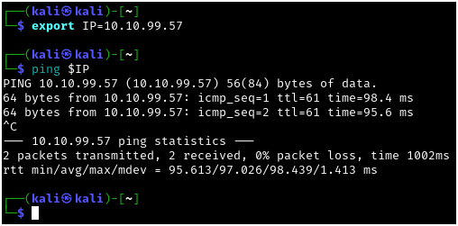

Next I ran a quick `nmap` scan to see which ports were responding on the host: 

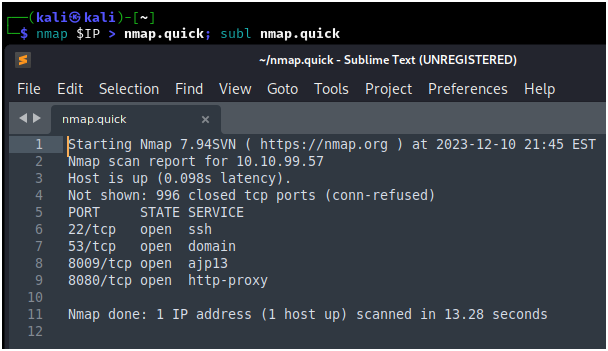

After that I wanted to further enumerate the service versions and run some basic `nmap` scripts against these ports:

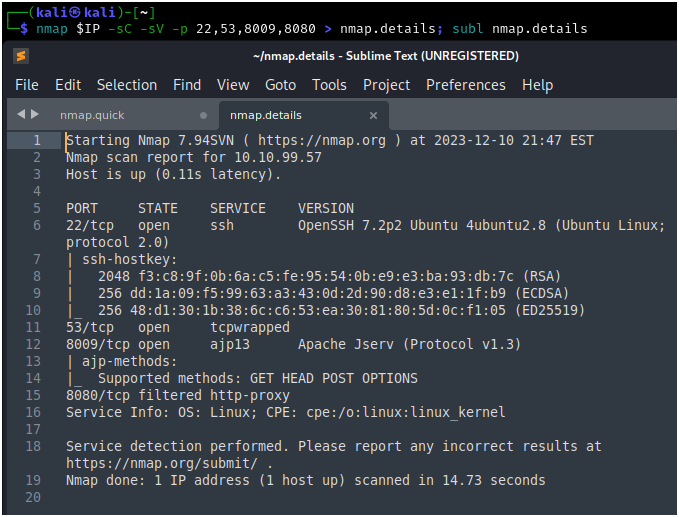

I also ran an `nmap` scan of all ports following this, but I did not discover any more open ports on this box. The first thing to check out is the web server running on port 8080:

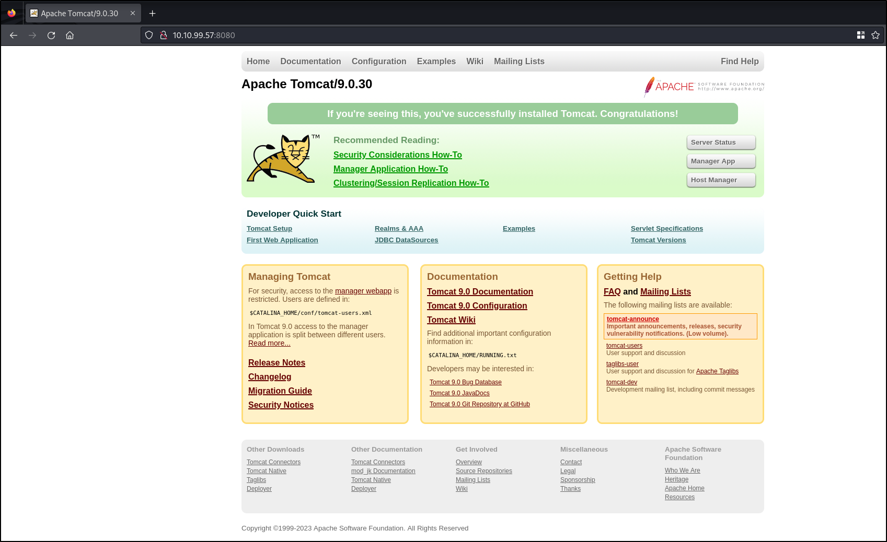

This just looks like a default page for Apache Tomcat, which should be cleaned up but is not actionable right now. Next, I'll use `searchsploit` to see if there are any published exploits for the "AJP" service we saw on port 8009:

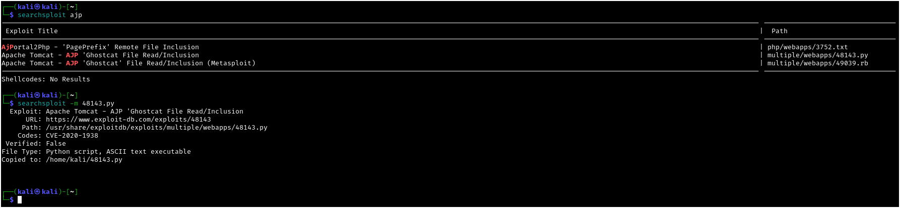

Here we can see that Apache Tomcat has an exploit called "Ghostcat" that has both a published python exploit and a Metasploit module. I'll be using both for demonstration purposes. You can see that I've moved the python exploit for use later.

## Metasploit

Here we are going to run the Ghostcat module using the default file. Theoretically we could read any file, but for the purpose of checking for low-hanging fruit, I'm just going to run the default. The only option we need to configure in this case is the RHOSTS parameter, which we can set globally using `setg`.

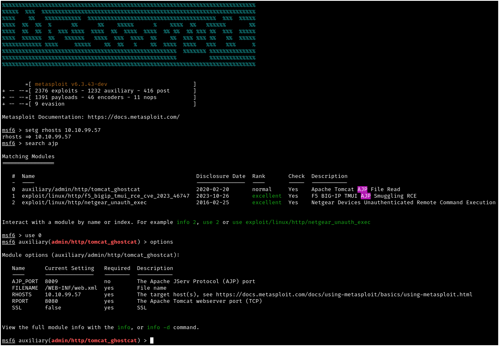

Running the module, we are able to read a file that in this case contains a set of credentials:

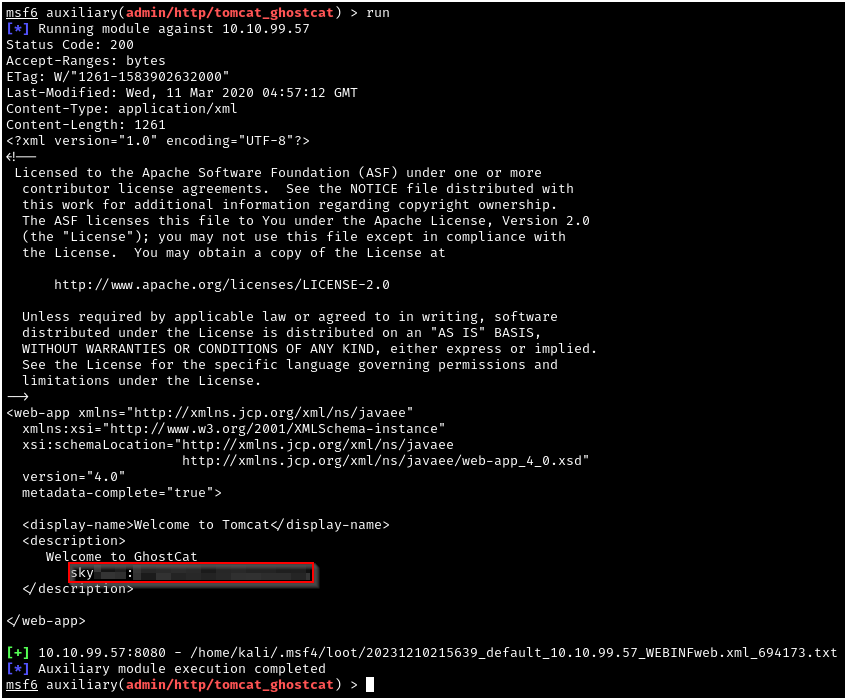

## Python Exploit

For demonstration purposes, we could also run the python exploit that we grabbed from `searchsploit` earlier. In this situation, we would assume that we researched the exploit and now know that Apache Tomcat can sometimes store sensitive information within /WEB-INF/web.xml, and we can use the python script that we copied over to find the usage for the script as seen:

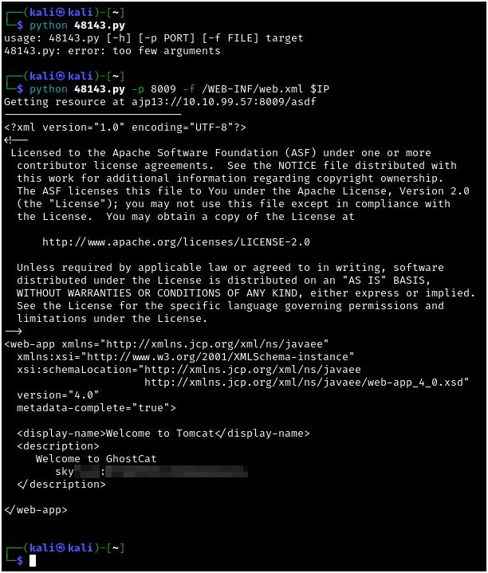

## Gaining Access

Now that we have some credentials for a user, which for the purposes of "keeping it professional" we're going to refer to as "Sky" for the next two steps. Based on our port scanning, we know we have an SSH port open, so we could either try to look around for an admin portal on the Tomcat web server, or we could just jump straight to SSH and try to log in, which we will do successfully in this case:

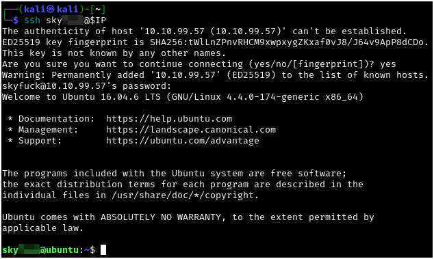

After finding that Sky is unable to use sudo on this machine, I decided to look around in the home directory to see if could find anything interesting. In this case, two files jumped out at me - a credential.pgp file that might hold some credentials, and the corresponding ASCII file in tryhackme.asc. I moved these two files to my attacking host using `nc` so that we could proceed to decrypt the file offline:

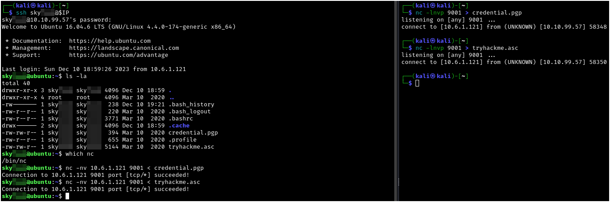

With the files now on my Kali host, I can run `gpg2john` against the ASCII file in order to get a hash to crack. Passing this hash to `john` gives me the password I can use to both import and decrypt the PGP file. After decrypting credential.pgp, we are given a "merlin" user's credentials.

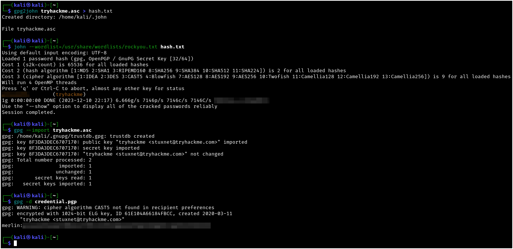

## Escalating Privileges

With these new credentials, I am able to `ssh` into the box with the merlin account. By checking programs we can run as root with `sudo -l` we are able to see that merlin is able to run `zip` as root:

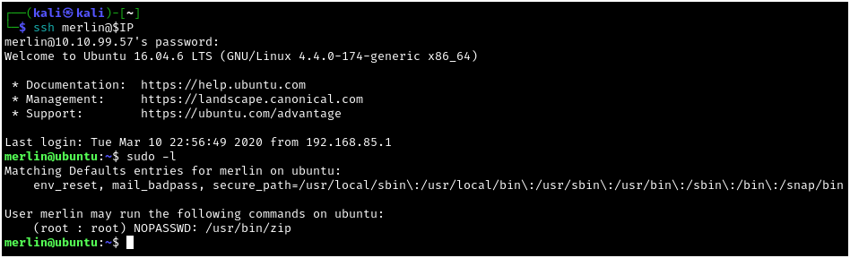

Referencing GTFOBins, we can see that there is a well-known exploit for escalating to root using `zip`:

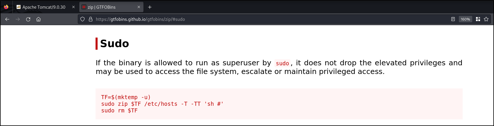

I slightly modified the exploit commands to get a `bash` shell instead of `sh` and also to run in a single line. After running this string of commands, I was able to escalate to root, where I was also able to escalate to root and read the root.txt and merlin's user.txt file. 

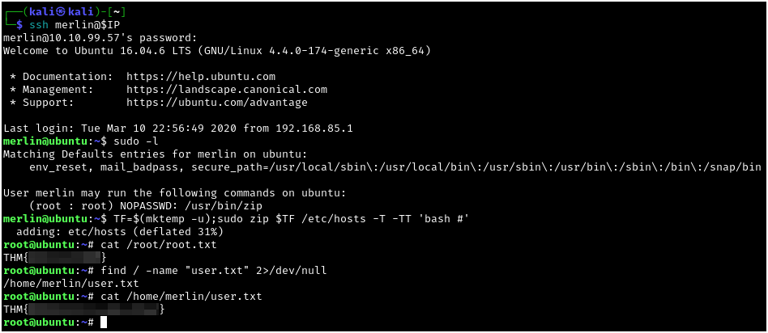

This was a fun proof of concept for CVE-2020-1938 (Ghostcat); thanks to stuxnet for the creation of this challenge!
